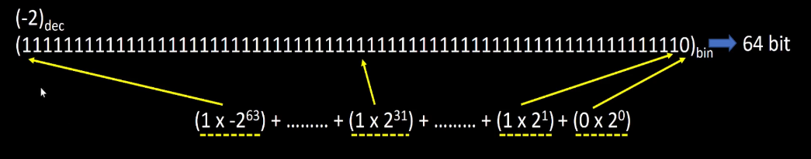
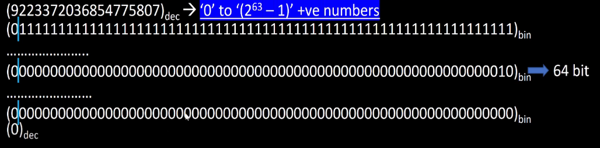

# Day 1 of RISC-V Design: RISC-V ISA and GNU Compiler

Day 1 of the RISC-V Design course introduces the concepts regarding the software to hardware flow.
The instructions were provided by [VSD](https://vlsisystemdesign.com) and [Redwood EDA](https://www.redwoodeda.com)

- **Author :** Ujval Madhu
- **Acknowledgement :** Kunal Ghosh, [VLSI System Design(VSD)](https://vlsisystemdesign.com)
- **Change Log :**  V 1.0, 29 March 2025

## Tools Used
- GNU tool chain for RISC V compilation
- Spike Debugger

## Description:

The following concepts are introduced in the course:

1. **Psuedo Instuctions**: Pseudo instructions (also sometimes called assembler directives or synthetic instructions) are instructions that are not part of the processor's actual hardware instruction set (the ISA). Instead, they are directives or shorthand notations provided by the assembler (the program that translates assembly code into machine code) to make programming easier and more convenient for humans. 
The assembler's job is to recognize these pseudo instructions and translate them into one or more actual machine instructions that the processor can directly execute. This translation happens during the assembly process, before the final machine code is generated.

Here are some common examples of Psuedo Instructions:
1. li (Load Immediate): This pseudo instruction is used to load a 32-bit immediate value into a register. The actual RV32I instruction set might have limitations on the size of immediate values that can be directly encoded in a single instruction. The assembler might translate a li instruction with a large immediate into a sequence of lui (Load Upper Immediate) and addi (Add Immediate) instructions.
2. mv (Move): This pseudo instruction copies the value from one register to another. It's typically translated into an addi instruction with an immediate value of 0.
3. la (Load Address): This pseudo instruction loads the address of a label (a memory location) into a register. The assembler will calculate the address of the label and then generate the necessary instructions (often involving lui and addi or similar) to load that address into the specified register.
4. j (Jump): This pseudo instruction performs an unconditional jump to a target address. It's often translated into a jal (Jump and Link) instruction with the destination register set to x0 (the zero register), effectively discarding the return address since it's an unconditional jump.
5. call: This pseudo instruction is often used for function calls. It typically translates to a jal instruction with the return address stored in the standard return address register (ra or x1).
6. ret (Return): This pseudo instruction is used to return from a function. It usually translates to a jalr (Jump and Link Register) instruction that jumps to the address stored in the return address register (ra).

2. **Base Integer Instructions RV32I, RV64I, RV128I**

The Base Integer Instructions in RISC-V (RV32I, RV64I, RV128I) define the core set of instructions for integer computation. The primary difference between these variants lies in the width of the general-purpose integer registers they use:

- RV32I (32-bit Integer): This is the most fundamental base integer ISA. It features 32 general-purpose registers, each 32 bits wide. Instructions in RV32I operate primarily on 32-bit integer data.

- RV64I (64-bit Integer): This extends RV32I by providing 32 general-purpose registers, each 64 bits wide. RV64I can operate on both 64-bit and 32-bit integer data. Instructions for 32-bit operations are typically included for efficiency and compatibility. RV64I is a very common and widely supported base ISA.

- RV128I (128-bit Integer): This is the largest of the base integer ISAs, featuring 32 general-purpose registers, each 128 bits wide. RV128I supports operations on 128-bit, 64-bit, and 32-bit integer data. This variant is intended for applications requiring very large integer values.

3. Multiply Extension Instructions RV64M

The Multiply Extension Instructions in RISC-V are part of the 'M' standard extension to the base integer instruction set (like `RV32I, RV64I`, etc.). This extension adds instructions for performing integer multiplication.

Purpose: The base integer instruction sets (like RV32I) typically only include instructions for addition, subtraction, and bitwise logical operations. The 'M' extension provides dedicated instructions for performing multiplication, which can be significantly more efficient than implementing multiplication using a series of additions and shifts.

Instructions Provided: The 'M' extension introduces several multiplication instructions, including:

mul rd, rs1, rs2: This instruction multiplies the values in registers rs1 and rs2 and writes the lower half of the result to register rd. For example, in RV32I, it multiplies two 32-bit numbers and stores the lower 32 bits of the 64-bit product in rd.
mulh rd, rs1, rs2: This instruction multiplies the values in rs1 and rs2 and writes the upper half (most significant bits) of the result to register rd. For RV32I, it stores the upper 32 bits of the 64-bit product.
mulhu rd, rs1, rs2: Similar to mulh, but it performs an unsigned multiplication and stores the upper half of the unsigned product in rd.
mulhsu rd, rs1, rs2: This instruction performs a multiplication of a signed rs1 and an unsigned rs2, storing the upper half of the result in rd.
Efficiency: These dedicated instructions allow the processor to perform multiplication operations much faster and more efficiently in hardware compared to software implementations using basic arithmetic and logical instructions.

If a RISC-V implementation includes the 'M' extension (often indicated in the architecture name like `RV32IM , RV64IM`), it will have these dedicated multiplication instructions available.

4. Single and Double Precision Floating Point Extension RV64F & RV64D
The Single and Double Precision Floating Point Extensions in RISC-V are standard extensions that add support for floating-point arithmetic.

### Single-Precision Floating Point Extension ('F'):
The Single and Double Precision Floating Point Extensions in RISC-V are standard extensions that add support for floating-point arithmetic. Briefly:

- Single-Precision Floating Point Extension ('F'):
Adds support for 32-bit single-precision floating-point numbers, compliant with the IEEE 754 standard.
Introduces 32 floating-point registers (typically named f0 to f31), which are separate from the integer registers.
Provides instructions for performing arithmetic operations (addition, subtraction, multiplication, division, square root), comparisons, conversions between integer and floating-point formats, and moving data between memory and floating-point registers for single-precision values.

- Double-Precision Floating Point Extension ('D'):
Adds support for 64-bit double-precision floating-point numbers, also compliant with IEEE 754.
Typically builds upon the 'F' extension.
Allows the same 32 floating-point registers to hold either single-precision or double-precision values. For double-precision, each value occupies two consecutive 32-bit slots in the register file.
Provides instructions for performing arithmetic operations, comparisons, conversions, and data transfers for double-precision values.
In essence, these extensions enable RISC-V processors to perform calculations involving real numbers with varying levels of precision, which is crucial for many scientific, engineering, and graphics applications. The 'D' extension generally implies the presence of the 'F' extension. Processors supporting these extensions will often have 'F' and/or 'D' in their architecture name (e.g., RV32IF, RV64IMFD).

5. Application Binary Interface (ABI)
This will be discussed in Day 2.

6. Memory Allocation and Stack Pointer

When a program runs on a RISC-V processor, it uses different regions of memory to store various types of data. Here are the common memory regions:

- Text (Code): This region stores the executable instructions of the program. It's typically read-only.
- Data (Global and Static Variables): This region stores global variables and static variables whose lifetime extends throughout the program's execution.
   - Initialized Data Segment (.data):
    This region stores global and static variables that have been explicitly initialized with a non-zero value in the source code.
    The assembler and linker will place these variables and their initial values in the .data section of the program's executable file. When the program is loaded into memory, this section is initialized with the specified values.
   - Uninitialized Data Segment (BSS - Block Started by Symbol):
   This region stores global and static variables that have been declared but not explicitly initialized in the source code, or those explicitly initialized to zero.
   The .bss section in the executable file doesn't actually store initial values (as they are zero or undefined). Instead, it just reserves space in memory. When the program starts, the system typically initializes all the memory in the .bss segment to zero. This is done for convenience and to provide a predictable initial state.
- Stack: This region is used for managing function calls, local variables, and return addresses. It operates on a Last-In, First-Out (LIFO) principle.
- Heap: This region is used for dynamic memory allocation, where the program can request memory blocks at runtime as needed.

#### Stack Memory Allocation and the Stack Pointer (sp or x2):

The stack is a crucial memory region for the execution of functions. Here's how it works in relation to the stack pointer:

Purpose: The stack is primarily used for:

Storing local variables of functions.
Passing arguments to functions.
Saving the return address when a function is called, so the program knows where to go back after the function finishes.
Saving the state of certain registers (like saved registers) across function calls.
LIFO Structure: The stack operates as a Last-In, First-Out (LIFO) data structure. When a function is called, a new "stack frame" is created on the stack. This frame contains the space needed for the function's local variables, arguments, and saved registers. When the function returns, its stack frame is deallocated, effectively making the memory available for the next function call.

Stack Pointer (sp or x2): The stack pointer is a dedicated register (specifically x2 according to the RISC-V ABI) that holds the memory address of the top of the stack.

Stack Growth: In most RISC-V implementations, the stack grows downwards in memory (towards lower memory addresses).
Function Call: When a function is called:
The stack pointer is typically decremented to allocate space for the new stack frame. This space might include storage for local variables, saved registers (if the function needs to use callee-saved registers), and the return address (if the function makes further calls).
The return address (the address of the instruction after the function call in the calling function) is often saved onto the stack (though the JAL instruction directly stores it in the ra register).
Function Return: When a function returns:
The stack pointer is incremented to deallocate the space used by the function's stack frame. This effectively discards the local variables and other data stored in that frame.
The return address is retrieved (from ra in the case of JAL) and used to jump back to the calling function.
Callee-Saved: As indicated in the table you provided, the stack pointer (sp) is a callee-saved register. This means that if a function modifies the stack pointer (which it will to allocate space for its stack frame), it must restore the stack pointer to its original value before returning to the caller. This ensures that the stack remains in a consistent state across function calls.

#### Heap Memory Allocation:

While the stack is for automatic, function-scoped memory management, the heap is used for dynamic memory allocation that is managed explicitly by the programmer.

Programs can request blocks of memory of a specific size from the heap at runtime using functions like malloc (in C).
The memory allocated from the heap remains allocated until it is explicitly freed by the program using functions like free.
Heap memory management is more complex than stack memory management and can lead to issues like memory leaks and fragmentation if not handled carefully.

Memory Layout of typical C programs is shown here:

    
    <figcaption> Memory Layout</figcaption>

7. Integer and Floating point Arithmetic:

Basics:
8 Bits = 1 Byte
4 Bytes = 1 Word = 32 Bits
2 Words or 8 Bytes = 1 Double Word = 64 Bits

Representation of unsigned positive numbers is straightforward binary representation , but signed numbers are better represented in 2's Complement form.

The number representation for 64 Bit signed and unsigned numbers is shown in the following figures:

    
    <figcaption> Number representation</figcaption>

An unsigned number can be represented as shown below:

    
    <figcaption> 64 bit Unsigned representation of 17,446,744,073,708,551,651</figcaption>

The range of unsigned numbers that can be represented using 64 Bits is shown here

    
    <figcaption> Range of unsigned numbers with 64 Bits</figcaption>

An signed number can be represented as shown below:

    
    <figcaption> 64 bit signed representation of 2</figcaption>

The range of positive signed numbers that can be represented using 64 Bits is shown here

    
    <figcaption> Range of positive signed numbers with 64 Bits</figcaption>

The range of negative signed numbers that can be represented using 64 Bits is shown here

    
    <figcaption> Range of negative signed numbers with 64 Bits</figcaption>

Data Model Depicting the sizes of Standard Data types in different Bases is shown in this figure:

    
    <figcaption> Data Model Depicting the sizes of Standard Data types in different Bases</figcaption>

Commonly used Data types and calling argument:

    
    <figcaption> Long, long long int and int versions</figcaption>

## Lab Procedure:

The Labs for day 1 included designing a simple C program to calculate the sum of numbers from 1 ..9, compiling it into RISC-V RV64i assembly instructions using the GNU compiler and debugging the code using Spike:

1. Command for compiling to RV64i instruction is shown here:
`riscv64-unknown-elf-gcc -0fast -mabi=lp64 -march=rv64i -o file_name.o file_name.c`

  - `-Ofast flag`: This flag enables aggressive optimizations for speed. The compiler will try to make your program run as fast as possible, even if it means potentially sacrificing strict adherence to language standards in some edge cases.
  - `-mabi=lp64` flag: This specifies the Application Binary Interface (ABI) to be used. lp64 is a common ABI for 64-bit systems where long and pointers are 64 bits, and int is 32 bits. This ensures that your code is compiled in a way that is compatible with other libraries and code using the same ABI.
  - `-march=rv64i` flag: This specifies the target RISC-V architecture. rv64i indicates the base 64-bit integer instruction set. The compiler will generate instructions that are supported by this base architecture.
  - `-o file_name.o` flag: This flag specifies the output object file name as file_name.o.

**Output**: This command will take the C source file (file_name.c) and produce a compiled object file named file_name.o. This object file contains the machine code for the program, but it is not yet a complete executable. In a typical build process it would need to be linked with other object files and libraries (if they exist) to create a final executable program.

2. To generate the output from the object file on the shell, we can use the spike command:
`spike pk file_name.o`

3. And to debug the object file we can use the spike command:
`spike -d pk file_name.o`

During debug(after the above command) if we want to look into any of the register values we can look into the internal registers of the processor by using: `reg [core] [reg_name, example a2]

## License

This project is licensed under the GNU General Public License, Version 3 - see the [LICENSE.md](../LICENSE.md) file for details.

## Contact

- Author: Ujval Madhu
- Email: ujvalmadhu003@gmail.com