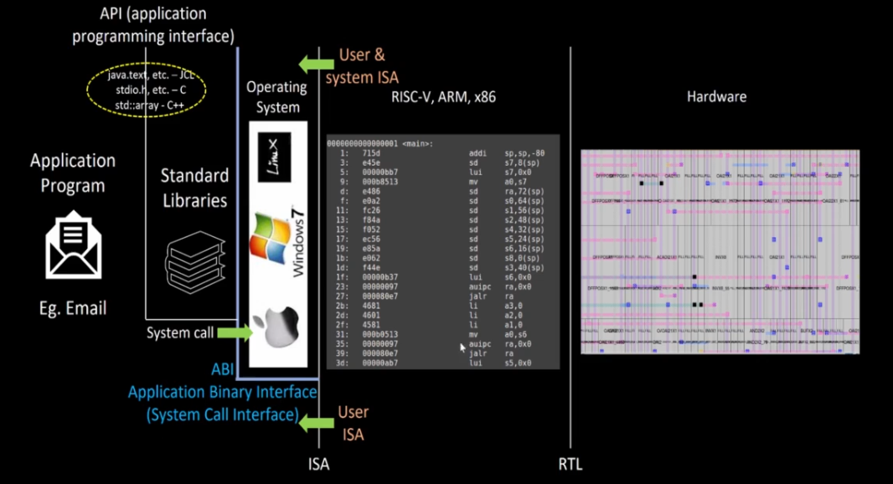
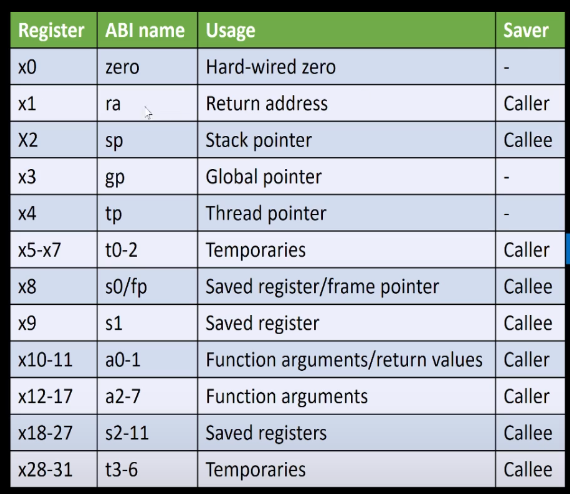

# Day 2 of RISC-V Design: Application Binary Interface (ABI)

Day 2 of the RISC-V Design course was a discussion of the concepts regarding ISA, ABI and Memory Architecture in RISC-V systems.
The instructions were provided by [VSD](https://vlsisystemdesign.com) and [Redwood EDA](https://www.redwoodeda.com)

- **Author :** Ujval Madhu
- **Acknowledgement :** Kunal Ghosh, [VLSI System Design(VSD)](https://vlsisystemdesign.com)
- **Change Log :**  V 1.0, 29 March 2025

## Tools Used
- GNU tool chain for RISC V compilation
- Spike Debugger

## Description:

**ISA (Instruction Set Architecture)**:

The Instruction Set Architecture (ISA) is the abstract interface between a computer's hardware and its software. It defines everything a software programmer needs to know to write machine code that the processor can understand and execute. Think of it as the language that the hardware speaks.   

Key aspects of an ISA include:

- Instruction Set: The complete set of instructions that the processor can execute (e.g., add, subtract, load, store, branch).   
- Addressing Modes: How operands (data) are located in memory (e.g., direct addressing, register addressing, immediate addressing).   
- Register Set: The number and types of registers available within the processor for storing data and control information.
- Data Types: The types of data that the processor can manipulate (e.g., integers of different sizes, floating-point numbers).   
- Instruction Format: The structure of an instruction, including the opcode (what operation to perform) and operands (where to get the data).   
- Control Flow: Instructions that control the order in which other instructions are executed (e.g., branches, jumps, calls, returns)

1. **User ISA**:

The User ISA (also sometimes referred to as the Application ISA or Unprivileged ISA) defines the subset of the ISA that is available to regular application programs running in user mode or unprivileged mode. These instructions are designed for general-purpose computation and data manipulation.   

Instructions in the User ISA typically include:

- Arithmetic and logical operations (add, subtract, AND, OR, XOR).   
- Data transfer instructions (load data from memory to registers, store data from registers to memory).   
- Control flow instructions for program logic (branches, jumps, function calls and returns).   
- Operations on user-level data structures.

Key characteristics of the User ISA:

- Limited Access: Instructions in the User ISA generally cannot directly access or manipulate system-critical resources like memory management units (MMUs), interrupt controllers, or peripheral devices. This protection is in place to prevent user programs from crashing the system or interfering with other applications.   
- Focus on Application Needs: These instructions are designed to perform the tasks that typical application software needs to accomplish.

2. **System ISA**:

The System ISA (also sometimes referred to as the Privileged ISA or Supervisor ISA) includes the instructions that are only accessible and executable when the processor is operating in a privileged mode, such as kernel mode or supervisor mode. These instructions allow the operating system or system software to manage and control the hardware and system resources.

Instructions in the System ISA typically include:

- Instructions for managing memory (e.g., setting up page tables, controlling the MMU).
- Instructions for handling interrupts and exceptions.
- Instructions for controlling peripheral devices (e.g., starting I/O operations).
- Instructions for managing processor modes and privileges.
- Instructions for accessing special control registers.
- Instructions for inter-process communication (in some architectures).

Key characteristics of the System ISA:

- Privileged Access: These instructions can directly access and manipulate system hardware and control the execution environment.
- Protection Mechanism: The processor enforces a distinction between user mode and privileged mode. Attempts by user-mode programs to execute System ISA instructions will typically result in a trap or exception, preventing unauthorized access to system resources.
- Operating System Responsibility: The operating system kernel is the primary user of the System ISA, using these instructions to manage the system on behalf of user applications.

**Relationship between User and System ISA:**

The User ISA and System ISA work together to provide a secure and managed computing environment. User programs run using the User ISA for their computations. When a user program needs to perform an operation that requires privileged access (e.g., reading a file from disk, sending data over a network), it makes a request to the operating system through a mechanism like a system call. This system call causes the processor to switch to a privileged mode, allowing the operating system kernel to execute instructions from the System ISA to fulfill the request on behalf of the user program. Once the privileged operation is complete, the OS typically returns control to the user program in user mode.

RISC-V explicitly defines different privilege levels, typically:

- User (U-mode): For general application code.
- Supervisor (S-mode): For operating system kernels (optional).
- Hypervisor (HS-mode): For virtualization (optional).
- Machine (M-mode): The most privileged mode, typically used for boot code and low-level hardware initialization.

Each privilege level has access to a specific subset of the RISC-V ISA. The User ISA corresponds to the instructions available in U-mode. The System ISA encompasses the instructions available in the higher privilege levels (S-mode, HS-mode, and M-mode), with M-mode having the most comprehensive access to system resources.

### Application Binary Interface

The Application Binary Interface (ABI) is a crucial specification that defines how independently compiled or assembled modules of code interact with each other at the binary level after they have been translated into machine code.

While both the Application Binary Interface (ABI) and the System Interface are crucial for software to function correctly, they operate at different levels and serve distinct purposes. System Interface operates at a higher, more abstract level. It defines how user-level applications interact with the operating system kernel.

Essentially, ABI focuses on the binary-level compatibility between different software components, where as,
System Interface focuses on the functional interaction between an application and the operating system.

The RISC-V ABI specifies the following:

- Register Usage and Conventions: This defines how registers are used for different purposes, such as passing arguments to functions, returning values, storing temporary data, and maintaining the call stack. For example, it specifies which registers are caller-saved (the calling function must save them if it needs their values after the call) and which are callee-saved (the called function must save and restore them).   
- Data Types and Layout: The ABI specifies the size, alignment, and representation of fundamental data types (like integers, floating-point numbers, and pointers) in memory. This ensures that different parts of the program interpret data in the same way.
- Function Calling Conventions: This is a critical part of the ABI and dictates how functions are called and how control is transferred between them. It includes:
  - How arguments are passed to functions (e.g., in registers or on the stack).   
  - How return values are passed back from functions.   
  - How the stack frame is managed (allocation, deallocation, and organization).
  - How exception handling is implemented at the binary level.
- System Calls: The ABI defines how user-level programs make requests to the operating system kernel (if one is present). This includes the calling convention for system call numbers and arguments.
- Object File Format: While not strictly part of the runtime ABI, the object file format (like ELF in many RISC-V implementations) is closely related and specifies how compiled code and data are organized before linking.
Linkage Conventions: The ABI specifies how symbols (like function names and global variables) are resolved across different object files during the linking process.

ABI important in RISC-V because it facilitates the following functions:

- Interoperability: It allows code written in different programming languages (e.g., C, C++, Rust, Go) and compiled by different compilers to be linked and run together correctly.
- Library Ecosystem: A well-defined ABI enables the creation of reusable software libraries. Developers can build libraries without needing to know the specifics of how each application will be compiled, as long as both adhere to the same ABI.   
- Operating System Compatibility: The ABI provides a standard interface between applications and the operating system kernel, allowing different applications to run on the same OS.
- Portability: While the RISC-V ISA itself provides a degree of hardware portability, a consistent ABI ensures that software can be easily moved between different RISC-V implementations that adhere to the same ABI.
Toolchain Development: A stable ABI simplifies the development of compilers, assemblers, linkers, and debuggers, as they have a clear target to work with.

A Diagram showing the interaction of the ABI, User & system interface is shown here:

    
    <figcaption>ABI, System and User Interfaces and flow of data </figcaption>

#### RISC-V ABI Variations:

Because RISC-V is modular, there can be different ABI specifications depending on the chosen base ISA and extensions. For example, there are ABIs for:

- Integer ISA (e.g., RV32I, RV64I): These define the basic integer register set and calling conventions.
- Floating-Point Extensions (e.g., F, D): These add specifications for how floating-point numbers are handled and passed in registers.   
- Calling Convention Variations: Different calling conventions might be defined for specific purposes or performance optimizations. For instance, there are "soft-float" ABIs where floating-point operations are performed using integer instructions, and "hard-float" ABIs that utilize dedicated floating-point hardware.

### Memory Architecture
RISC-V uses Little-Endian Memory Addressing for its internal registers.
The register architecture of RISC-V processors is a key part of its design philosophy, emphasizing simplicity and regularity. A description of the general-purpose integer registers is provided below:

#### Number of Registers and Size:

RISC-V specifies 32 general-purpose integer registers. These are denoted as x0 through x31.
The width of these registers depends on the base integer instruction set:
- RV32I: Registers are 32 bits wide.
- RV64I: Registers are 64 bits wide.
- RV128I: Registers are 128 bits wide.

#### Naming Convention:

Registers are primarily referred to by their numerical index, from x0 to x31.
For programmer convenience and to improve code readability, the RISC-V Application Binary Interface (ABI) defines standard names (aliases) for commonly used registers. These names reflect their typical roles in program execution.

A table of the common ABI names for the integer registers is shown here:

    
    <figcaption> Number representation</figcaption>

#### Special Registers:

- x0 (zero): This register is hardwired to the value zero. Writing to x0 has no effect, and reading from x0 always returns zero. It's commonly used as a source operand for operations that need a zero value or as a destination operand when the result is to be discarded.

- x1 (ra): Return Address Register: This register is used to store the return address when a JAL (Jump and Link) or JALR (Jump and Link Register) instruction is executed for a function call. When a function returns, the value in ra is typically used to jump back to the instruction following the call.

- Caller-saved registers (t0-t6, a0-a7, ra): The calling function expects that these registers might be modified by the called function. If the caller needs their values after the call, they must save them before the call and restore them afterward.

- Callee-saved registers (s0-s11, sp, gp, tp): The called function must preserve the values of these registers. If the called function uses these registers, it must save their original values upon entry and restore them before returning.

Here, the calling function and called function refer to:

- Calling Function: This is the function that initiates a call to another function. It's the function that contains the code that explicitly invokes or executes another function. Think of it as the function that makes the request for another function to run.

- Called Function: This is the function that is executed as a result of being called by another function. It's the function that receives the control from the calling function and performs its defined task. Once the called function finishes its execution, it typically returns control back to the calling function at the point immediately after the call was made.

**sp (Stack Pointer):**

Register: x2
Usage: The stack pointer is used to manage the runtime stack. The stack is an area of memory used for storing local variables, function arguments, and return addresses during function calls. The stack pointer typically points to the top of the stack.
Saver: Callee. This means that if a function (the callee) uses the stack pointer, it is responsible for saving its original value at the beginning of the function and restoring it before returning to the calling function.

#### gp (Global Pointer):

Register: x3
Usage: The global pointer is used to efficiently access global variables and static data. It typically points to a fixed offset within a global data area in memory. Using the global pointer can often result in shorter and faster code for accessing global data.
Saver: - (Not explicitly listed as Caller or Callee in this table, but typically considered Callee-saved in many ABIs, meaning the callee should preserve its value).

#### tp (Thread Pointer):

Register: x4
Usage: The thread pointer is used in multithreaded environments. It points to the thread-local storage (TLS) area for the current thread. This allows each thread to have its own private copy of certain global variables.
Saver: - (Not explicitly listed as Caller or Callee in this table, but typically considered Callee-saved).

#### Temporaries:

Registers: x5-x7 (t0-t2) and x28-x31 (t3-t6)
Usage: Temporary registers are intended for short-lived, intermediate calculations within a function. They are not guaranteed to be preserved across function calls.
Saver: Caller. This means that if the calling function (the caller) has values in these temporary registers that it needs after a function call, it is the caller's responsibility to save those values before making the call and restore them afterwards. The called function is free to use these registers without saving their original contents.

#### Saved Registers / Frame Pointer:

Registers: x8 (s0/fp) and x9-x27 (s1-s11)
Usage: Saved registers are used to hold values that need to be preserved across function calls. If a function (the callee) uses these registers, it must save their original values at the beginning of the function and restore them before returning.
Saver: Callee.
Frame Pointer (fp or s0):
Register x8 has a dual role and is often used as the frame pointer (also known as the base pointer). The frame pointer typically points to a fixed location within the current function's stack frame. This can be helpful for accessing local variables and function arguments, especially in scenarios where the stack pointer might change during the function's execution. Using a frame pointer can also aid in debugging.

#### a0-1 (x10-x11): Function Arguments / Return Values:

These two registers (x10 and x11) are used to pass the first and second arguments to a function.
They are also used to return the first and second return values from a function. If a function returns a single value that fits in a register, it will typically be placed in a0. If it returns two values, they will likely be in a0 and a1.
Saver: Caller. This means the calling function needs to save the values in a0 and a1 if it needs them after the function call, as the called function might modify them (especially if it's returning a value).

#### a2-7 (x12-x17): Function Arguments:

These registers (x12 through x17) are used to pass the third through eighth arguments to a function.
Saver: Caller. Similar to a0 and a1, the calling function needs to save these registers if their values are needed after the function call.

## License

This project is licensed under the GNU General Public License, Version 3 - see the [LICENSE.md](../LICENSE.md) file for details.

## Contact

- Author: Ujval Madhu
- Email: ujvalmadhu003@gmail.com