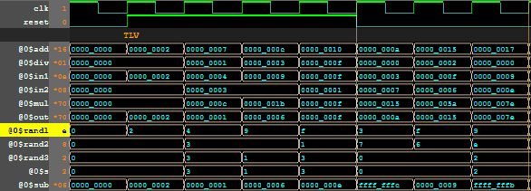
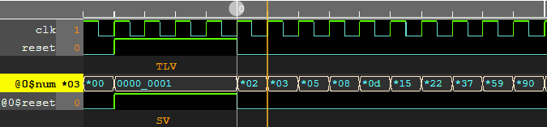
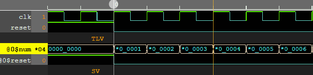
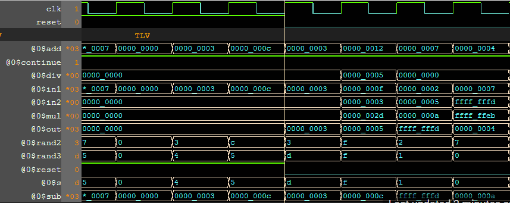
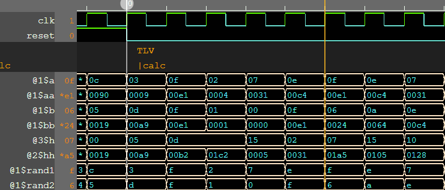

# Day 3 of RISC-V Design: Essential Training

This repository contains various TL-verilog files that were designed as part of an onramp for the RISC-V Design course offered by [VSD](https://vlsisystemdesign.com) and [Redwood EDA](https://www.redwoodeda.com)

- **Author :** Ujval Madhu
- **Acknowledgement :** Steve Hoover, Redwood EDA, LLC
- **Change Log :**  V 1.0, 21 March 2025

## Tools Used
- TL-Verilog
- [Makerchip](https://www.makerchip.com)

## Project Index

|  Sl No. | Project| Description| Bookmark |
|:-------|:-------|:-----------|:----------|
| 1 | Combinatorial Calculator | This is a simple combinatorial calculator that supports addition, subtraction, division and multiplication of 32 bit operands. |  |
| 2 | Fibonacci Sequence Generator  | This shows a 32 bit Fibonacci Sequence generator |  |
| 3 | 32-Bit Counter| A simple 32 bit up counter |  |
| 4 | Sequential Calculator | This is an implementation of the simple calculator with sequential logic and output feedback| |
| 5 | Pythagoras's Theorem | Pipelined logic to calculates the hypotenuse of a right triangle| https://makerchip.com/sandbox/0ADf9hQRW/0X6hXjN |
| 6 | Pipeline Error Detector| Compiles various errors that can occur at different stages of a pipeline | https://makerchip.com/sandbox/0ADf9hQRW/01jhMx4 |

Bookmarks might not work after a point of time.

#### Output Waveforms

The output waveforms generated using makerchip is shown below:

1. Simple Calculator

    

2. Fibonacci Sequence Generator

    

3. 32 bit Counter

    

4. Sequential Calculator

    

5. Pipelined Pythagoras's Theorem (output "h" is obtained after 2 clock cycles)

    

6. Pipeline Error Detector

    

## License

This project is licensed under the GNU General Public License, Version 3 - see the [LICENSE.md](../LICENSE.md) file for details.

## Contact

- Author: Ujval Madhu
- Email: ujvalmadhu003@gmail.com