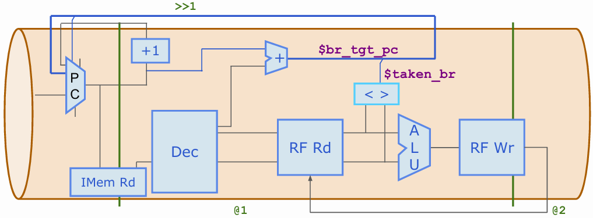
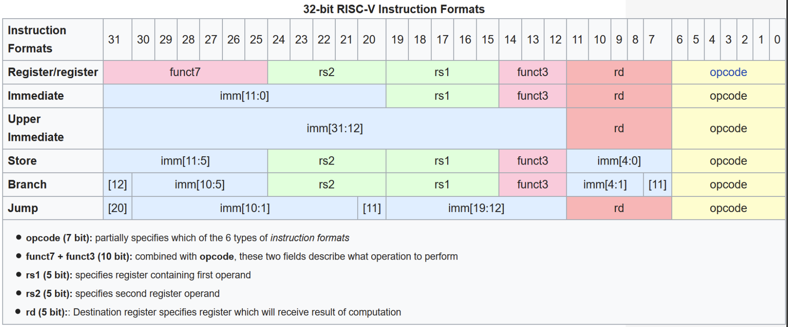
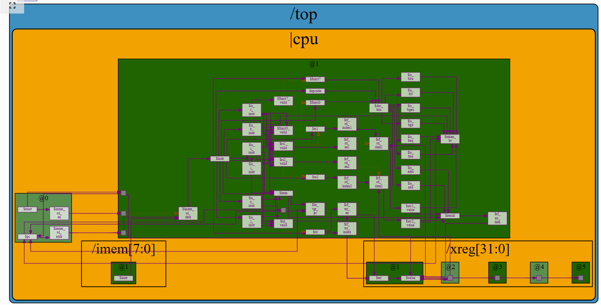
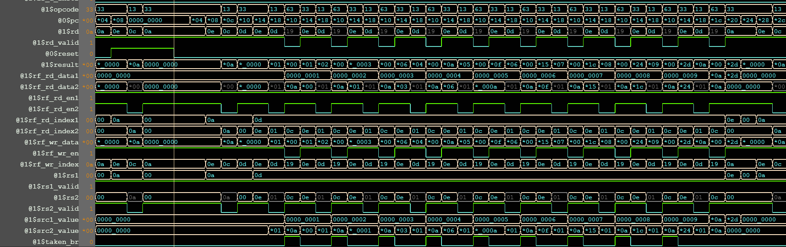

# Day 4 of RISC-V Design: Micro-Architecture

This repository contains the RISC-V Micro Architecture Designed using TL-Verilog based on the
instructions provided by [VSD](https://vlsisystemdesign.com) and [Redwood EDA](https://www.redwoodeda.com)

- **Author :** Ujval Madhu
- **Acknowledgement :** Steve Hoover, Redwood EDA, LLC
- **Change Log :**  V 1.0, 21 March 2025

## Tools Used
- TL-Verilog
- [Makerchip](https://www.makerchip.com)

## Project Index

|  Sl No. | Project| Description| Bookmark* |
|:-------|:-------|:-----------|:----------|
| 1 | riscv_mc_arch| This is an implementation of the RISC-V u-architecture in TL-Verilog | [Makerchip link](https://myth.makerchip.com/sandbox/0jRfjh1Qk/0X6hX5V) |

*Bookmarks might not work after a point of time

## Description

Day 4 work culminated in the the design of a simple RV321 compliant RISC-V processor without pipelining. 

The genral diagram showing the different operations of the design is illustrated here:

    

The Key constituents of the design includes:

- Instruction Fetch (IF):

The PC (Program Counter) holds the address of the next instruction.
The IMem Rd (Instruction Memory Read) unit fetches the instruction from memory at the address specified by the PC.
The PC is incremented by +1 to point to the subsequent instruction in memory.
Branch prediction mechanism is implemented using the signal $taken_br.
If a branch is predicted to be taken, the next PC is determined by the $br_tgt_pc (branch target PC), which is calculated  and fed back. A multiplexer selects between the incremented PC and the branch target PC.

- The fetched instruction is passed to the Dec (Decode) unit:

The Decode unit analyzes the instruction to identify the operation and the required operands (source and destination registers).
It reads the values of the source registers from the RF Rd (Register File Read) port.

The RISC-V instruction format used for decoding is shown here:

    

- Execute (EX):

The decoded instruction and the fetched register values are sent to the ALU (Arithmetic Logic Unit).
The ALU performs the operation specified by the instruction decoded by the decode unit.
The branch condition is also evaluated in this stage using the comparator < > which checks the instruction, and generates the $taken_br signal indicating whether the branch condition is met. The result of this comparison influences the next PC in the Instruction Fetch stage.

- Write Back (WB):

The result from the ALU is written back to the RF Wr (Register File Write) port into the destination register.

## Verification
The implementation is verified using a test program that is written into the instruction memory to sum the numbers 1 to 9.
The value of the register file was observed to be equal to the required sum during the simulation. 

#### Output

The output waveforms generated using makerchip is shown below:

1. RISC-V Micro Architecture Generated using Makerchip

    

2. Waveforms from the register file read and write transactions

    

## License

This project is licensed under the GNU General Public License, Version 3 - see the [LICENSE.md](../LICENSE.md) file for details.

## Contact

- Author: Ujval Madhu
- Email: ujvalmadhu003@gmail.com