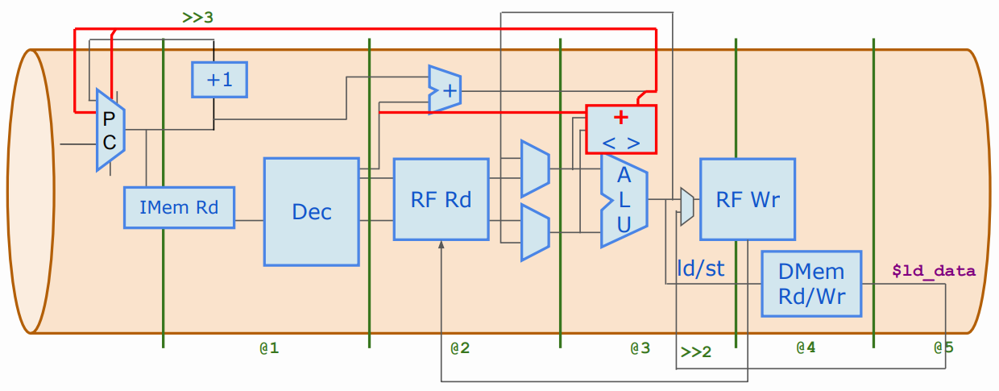
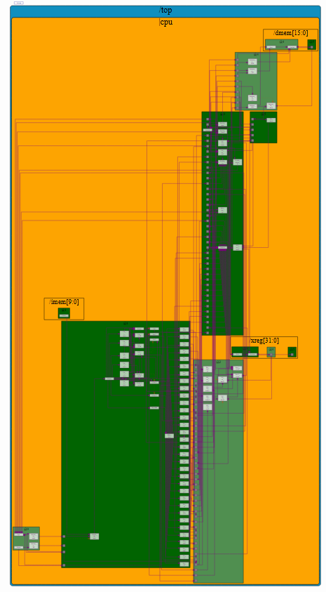
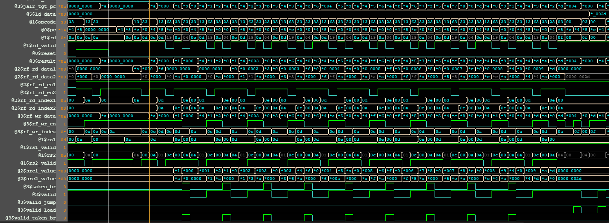

# Day 5 of RISC-V Design: Micro-Architecture

This repository contains the Pipelined RISC-V Micro Architecture Designed using TL-Verilog based on the
instructions provided by [VSD](https://vlsisystemdesign.com) and [Redwood EDA](https://www.redwoodeda.com)

- **Author :** Ujval Madhu
- **Acknowledgement :** Steve Hoover, Redwood EDA, LLC
- **Change Log :**  V 1.0, 21 March 2025

## Tools Used
- TL-Verilog
- [Makerchip](https://www.makerchip.com)

## Project Index

|  Sl No. | Project| Description| Bookmark |
|:-------|:-------|:-----------|:----------|
| 1 | riscv_mc_arch_pipelined| This is an implementation of the completed Pipelined RISC-V u-architecture in TL-Verilog | [Maker Chip](https://myth.makerchip.com/sandbox/0jRfjh1Qk/0Q1hkxL) |

Bookmarks might not work after a point of time.

## Description:

The RISCV implementation from Day4 is updated to be pipelined version in this project. This implemented microarchitecture is shown in the following figure:

Pipelined RISC-V Micro Architecture

    

Some Hazards that could arise from pipelining are also effectively mitigated in this implementation:
1. Branch Control Hazard
2. Read-Write Hazard
3. Read After Write Hazard: This deals the case where we need to write an operand to the Register file, which will be used by the next instruction in the ALU. This is done by creating register bypasses to the ALU, which would allow the output from the previous execution to be directly used by the ALU in the next execution.

Another improvement that was made was the correction of the branch target path. Since, we are not developing an early branch predictor path, we will have two cycles that will have to be be discarded after a branch prediction has been detected. This is done by implementing a valid signal that activates the RF write only when the previous two cycles did not have any branches predicted.

The complete RV321 Base Instruction set(Except FENCE, ECALL, EBRAKE) is coded to the decode logic and the ALU in this implementation.
We will also be using a single load instruction which loads the full word (LW) for all 5 variants of load, which are LB (load byte), LH (load half word), LW, LBU (load byte unsigned) and LHU (load half word unsigned).
Similarly, for Store we will only be supporting the Store Word SW instruction, instead of separate for all three SW, SH and SB.

#### This implementation also supports the Load Store instructions to Data Memory

In load operation we aim to load a value from the main memory into the CPU's Register file. and in store operation, we aim to write a value from the RF to the main memory.

Load operation is done by adding a MUX before RF write which can select the data read from the Data memory in 2 cycles if a load operation is needed.

#### Finally, this implementation also supports the Jump Instructions from the RV321 Base instruction set
Jump instructions like JAL(jump and link) and JALR(Jump and Link Register) are implemented, both these instructions also create 2 invalid cycles which are ignored.

JAL performs an unconditional jump to a target address and simultaneously saves the address of the instruction following the jump (the return address). JALR also performs a jump and saves a return address, but the target address is calculated differently.

The JAL requires that the PC be updated with the PC + immediate value, and the JALR requires that the PC be updated with SRC1 Value (1st operand to the ALU).

JAL is primarily used for making function calls. When the function is finished, it can use JALR (explained below) to jump back to the instruction after the original JAL.

JALR is typically used to return from a function. When the target address of a jump is not known until runtime, it can be calculated and stored in a register. JALR can then be used to jump to that address.

#### Output

The final implemented Design and the output waveforms generated using makerchip are shown below:

1. Final Implemented Pipelined RISC-V Micro Architecture

    

2. A Snippet of the output waveform is shown here:

    

## License

This project is licensed under the GNU General Public License, Version 3 - see the [LICENSE.md](../LICENSE.md) file for details.

## Contact

- Author: Ujval Madhu
- Email: ujvalmadhu003@gmail.com